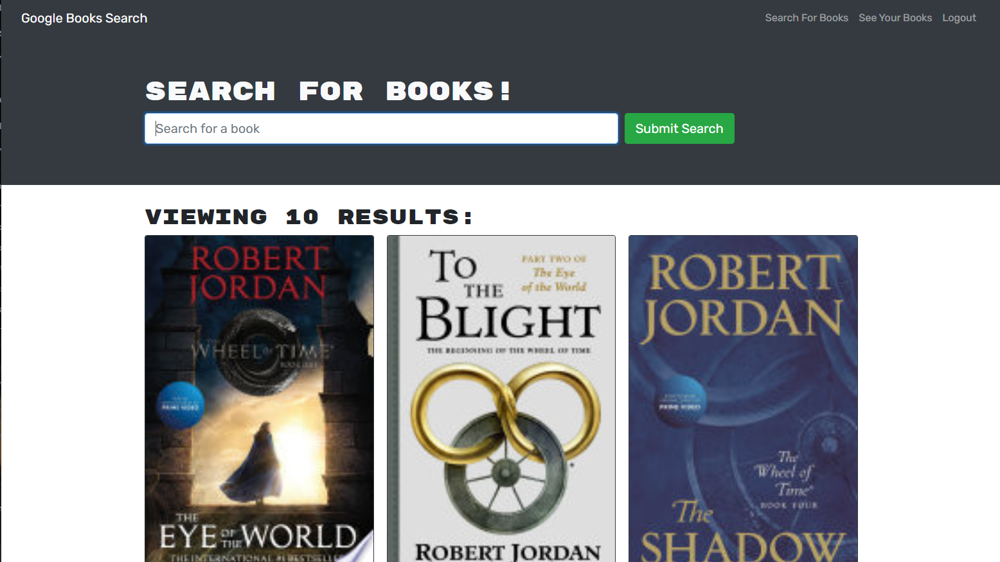

# graphql-refactor
This is taking an existing react app that was talking to a rest API and 
refactoring it to use graphql with an apollo server to connect to the same 
database

## About this app

The website itself is very simple. You can search for books and then it queries
the google books API to find books. If you want to save the books that you are
querying then you can create a login and save them. You are able to get them at
a later time by looking at the saved books tab.

It is deployed to heroku at: 

https://mighty-island-56779.herokuapp.com/

What I did personally was take a router that queried mongoose driectly and 
instead used Apollo graph ql to do all the querying instead. 

## Using the app locally

In order to run this app you will need a local installation of 
[NodeJS](https://nodejs.org) and [MongoDB](https://www.mongodb.com/)

Download the repository, and run `npm install` in the root directory. To see
how the app works you can then run `npm run develop` to open the development
environment.

By default the app will be hosted to `localhost:3000` and the back end is 
`localhost:3001`, you can make queries to the graph ql side of things by
opening `localhost:3001/graphql` to see the sandbox. 

For editing graph ql, I recomment using 
[this syntax highlighting extension](https://marketplace.visualstudio.com/items?itemName=kumar-harsh.graphql-for-vscode) 
so the graphql doesn't look all one color since it's just a string literal. 

## Steps I took to accomplish this

1. create typedefs for the data

  This equates to making a typedefs file on the server side which defines the 
  different types of queries and mutations that can be made to the database,
  and what they will return. They live in `/server/schemas/typeDefs.js`

2.  create resolvers

This is how the typedefs are resolved. It is the "backend to the backend" so to
speak. They amount to talking to the mongoose models, getting or mutating the 
appropriate data, and then sending applicable information to the front end. The
resolvers are in `/server/schemas/resolvers.js`

3. passing those into the server

To create an apollo server for graph ql you need to pass those typedefs and
resolvers into it. After that you essentially use the entire express server as
middleware for the apollo server. When creating it, some authentication was made
useing [Javascript web tokens](https://jwt.io/). As well. These tokens are a 
nifty way of authenticating a session without needing to store cookies in a 
database. 

4. updating the client to make graph ql queries

This just meant making the `/client/src/App.js` file have access to the apollo 
client and wrapping the react router in it. 

5. Creating files to make graphql queries and mutations

These are files in `/client/src/util` notably `mutation.js` and `queries.js`
they're the special magic strings that apollo uses to make queries. 

6. Replacing the existing requests. 

You can still see the existing requests in `/client/util/API.js` those were all
replaced with the exception of the requests made to the google books API. This 
meant going through each component and changing the imports from the API file to
my mutations and queries files, and passing those imported graph ql queries to 
the `useQuery()` and `useMutation()` functions in the apollo client.

7. Deploying to heroku

It is a pretty straight forward process. I reserved a free mongo cluster and
passed the URI for it into my heroku app, and pushed the contents of my main 
branch there. After a bit of waiting it all started to work quite nicely.  

## Technologies

 

## License

## Credits

License badge from: https://gist.github.com/lukas-h/2a5d00690736b4c3a7ba
Technology badges from: https://github.com/Ileriayo/markdown-badges

Starter react code provided by the Berkeley coding bootcamp